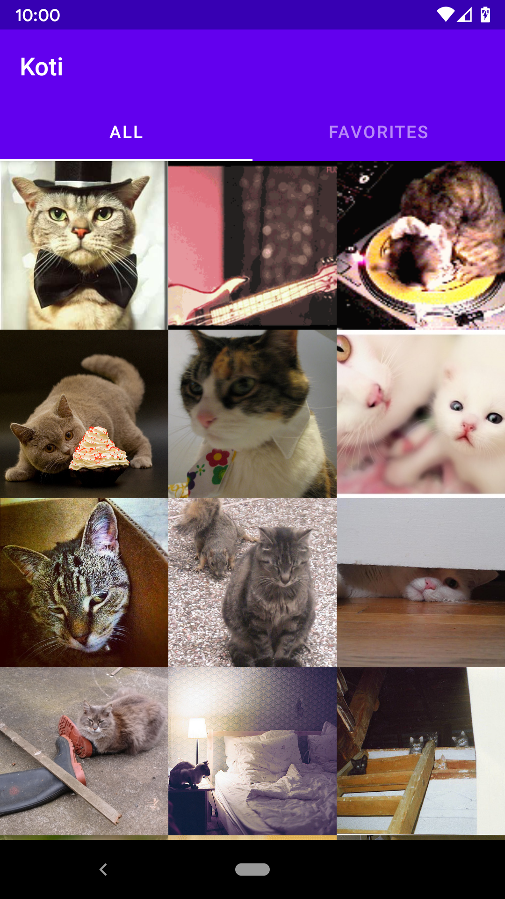
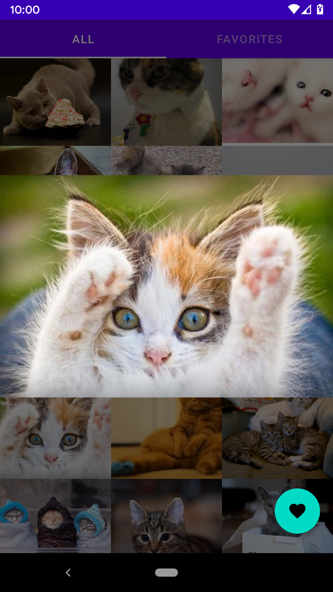
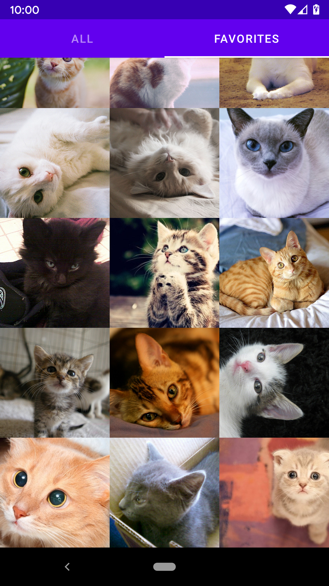

# Koti
Sample Android application in Kotlin using lastest jetpack libraries, retrofit and Koin. Browse random cats from [the cat api](http://thecatapi.com) indefinitely and save your favourites in offline first manner.

## Used libraries
* [Retrofit](https://square.github.io/retrofit/) with coroutines for API calls
* [Moshi](https://github.com/square/moshi) for JSON parsing
* [Paging3](https://developer.android.com/topic/libraries/architecture/paging) for infinite scroll
* [Coil](https://coil-kt.github.io/coil/) for image loading
* [ViewMOdel](https://developer.android.com/topic/libraries/architecture/viewmodel) + LiveData for architecture
* [Room](https://developer.android.com/topic/libraries/architecture/room) for persistence
* [Work Manager](https://developer.android.com/topic/libraries/architecture/workmanager) for backend synchronization
* [Koin](https://start.insert-koin.io/#/introduction) for dependency injection
* Material design libraries for UI
